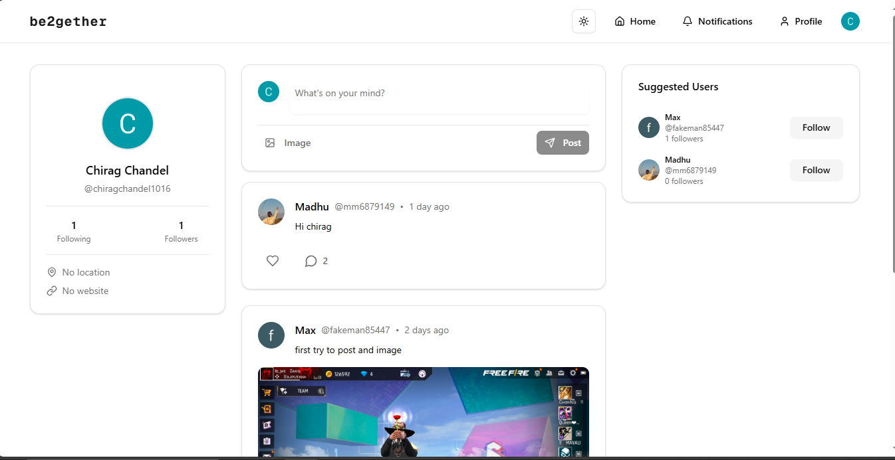

<h1 align='center'>🫂 be2gether - A Full Stack social media app</h1>
A social media app - “be2gether is a modern social media platform where users can connect, share, and engage — built with Next.js and powered by Clerk & Prisma.”

---

## 🚀 Features
- 🔐 Authentication with **Clerk** (Sign up, Sign in, Manage sessions)
- 📝 Create and delete posts
- 📸 Image upload using **UploadThing**
- 👤 User profiles with dynamic routes
- ❤️ Follow/unfollow users
- 🔔 Notifications system
- 🌙 Light/Dark mode toggle
- 🎨 Styled with **Tailwind CSS + shadcn/ui**
- 🗄️ Database with **Prisma + PostgreSQL**

---

## 📂 Project Structure

```bash
be2gether/
├── prisma/              # Prisma schema & migrations
├── public/              # Static assets
├── src/
│   ├── actions/         # Server actions (posts, users, profiles, notifications)
│   ├── app/             # Next.js App Router pages & API routes
│   ├── components/      # UI & feature components
│   ├── lib/             # Utilities (Prisma, UploadThing, helpers)
│   └── middleware.ts    # Auth & middleware logic
└── package.json
```

---

## 🛠️ Tech Stack
- **Frontend**: Next.js, React, Tailwind CSS, shadcn/ui  
- **Auth**: Clerk  
- **Database**: PostgreSQL + Prisma ORM  
- **File Uploads**: UploadThing  
- **Deployment**: Vercel  

---

## ⚙️ Getting Started

### 1. Clone the repository
```bash
git clone https://github.com/ExploreInsight/be2gether.git
cd be2gether
```

### 2. Install dependencies
```bash
npm install or npm i
```
### 3. Set up environment variables
Create a .env file in the root with the following:

```bash
DATABASE_URL=your_postgres_url
NEXT_PUBLIC_CLERK_PUBLISHABLE_KEY=your_clerk_publishable_key
CLERK_SECRET_KEY=your_clerk_secret_key
UPLOADTHING_TOKEN=your_uploadthing_token

```
### 4. Run Prisma migrations
```bash
npx prisma migrate dev
```

### 5. Start the development server
```bash
npm run dev
```
## 📸 Screenshot

### 🏠 Homepage


### 👨‍💻 Author
Chirag
